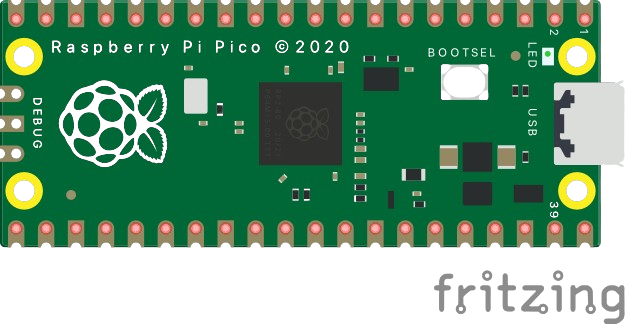
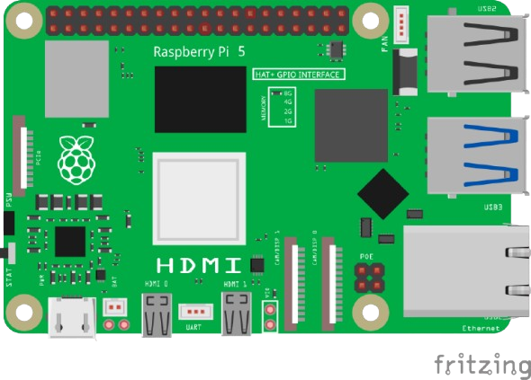
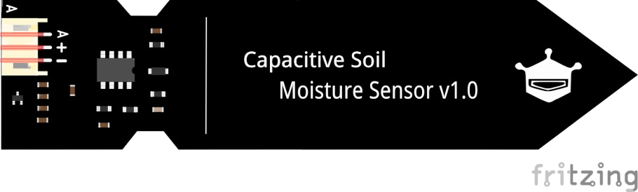
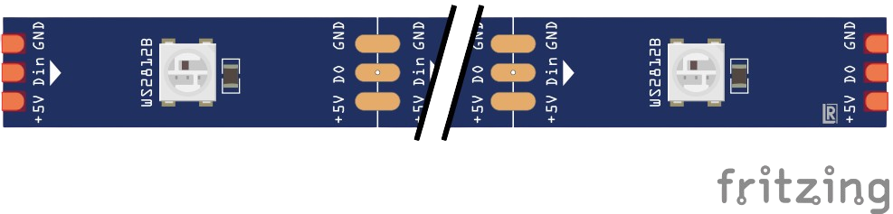
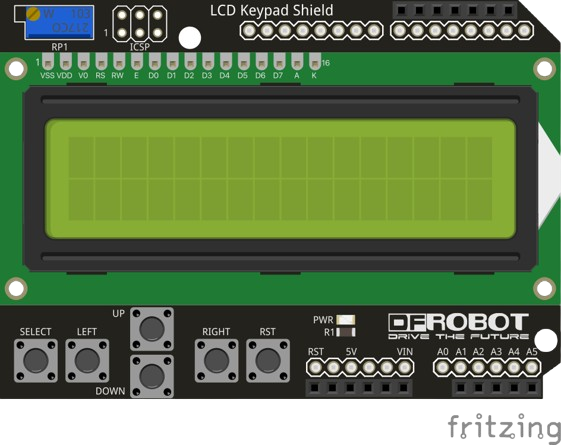

# 📦 Fritzing Parts

Coleção de partes não nativas (`.fzpz`) para Fritzing.

Para utilizar, basta baixar o arquivo e importar para o Fritzing através da aba "Mine"

---

 

## 🔌 Conectores

### Banana Jack

- [Preto](/parts/banana-jack-black.fzpz)
- [Azul](/parts/banana-jack-blue.fzpz)
- [Verde](/parts/banana-jack-green.fzpz)
- [Vermelho](/parts/banana-jack-red.fzpz)
- [Amarelo](/parts/banana-jack-yellow.fzpz)

Link para a postagem original no [Fórum da Fritzing](https://forum.fritzing.org/t/binding-posts-aka-banana-plug-jacks-aka-speaker-jacks/14418/2)

---
### Banana Jack

- [Preto](/parts/banana-plug-black.fzpz)
- [Azul](/parts/banana-plug-blue.fzpz)
- [Verde](/parts/banana-plug-green.fzpz)
- [Vermelho](/parts/banana-plug-red.fzpz)
- [Amarelo](/parts/banana-plug-yellow.fzpz)

Link para a postagem original no [Fórum da Fritzing](https://forum.fritzing.org/t/binding-posts-aka-banana-plug-jacks-aka-speaker-jacks/14418/2)

---

 

## 🧠 Placas

### [Raspberry Pi Pico](/parts/raspberry-pi-pico.fzpz)

Link para a postagem original no [Fórum da Fritzing](https://forum.fritzing.org/t/looking-for-raspberry-pi-5-fritzing-part/21511)

---

### [Raspberry Pi 5](/parts/raspberry-pi-5.fzpz)

Link para a postagem original no [Fórum da Fritzing](https://forum.fritzing.org/t/looking-for-raspberry-pi-5-fritzing-part/21511)

---

 

## 🌡️️ Sensores

### [Capacitive Soil Moisture](/parts/capacitive-soil-moisture.fzpz) 

	
Link para o repositório original da [DFRobot](https://github.com/OgreTransporter/fritzing-parts-extra/blob/master/DFRobot_Capacitive_Soil_Moisture_Sensor_V1.0.fzpz)

---

### [WS2812 RGB Led Strip](/parts/WS2812-rgb-led-strip.fzpz)

Link para a postagem original no [Fórum da Fritzing](https://forum.fritzing.org/t/ws2812-rgb-led-strip-matrix/6339)

---

 

## 🛡️ Shields

### [LCD Keypad Shield](/parts/lcd-keypad-shield.fzpz)

Link para o repositório original do(a) [RafaGS](https://github.com/RafaGS/Fritzing/blob/master/LCD%20Keypad%20Shield.fzpz)

---

 

### Se esse repositório te ajudou, considere deixar uma ⭐️ e/ou se tornar um [sponsor](https://github.com/sponsors/mari-barbosa) ❤️
